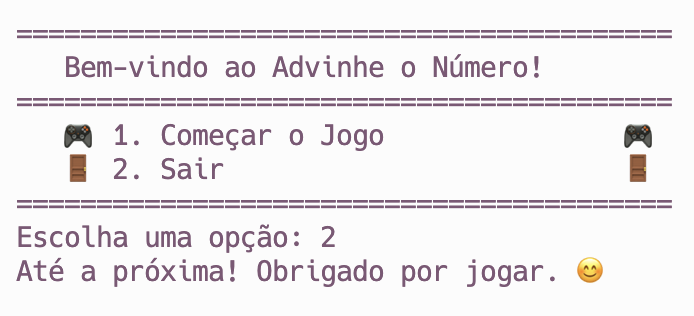
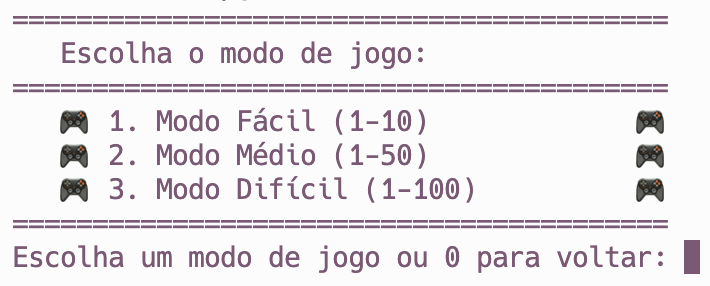
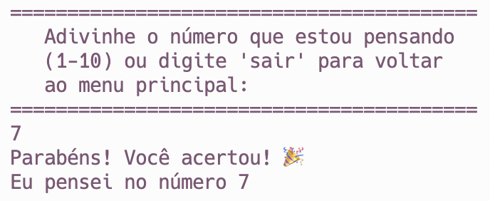
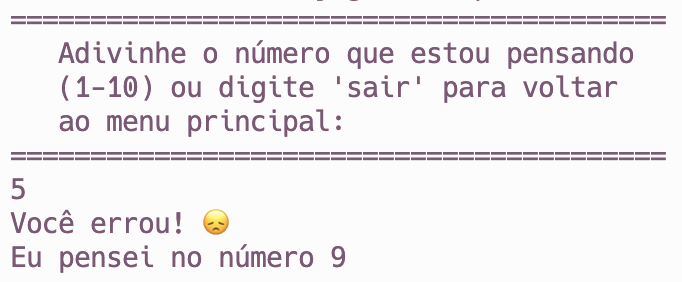
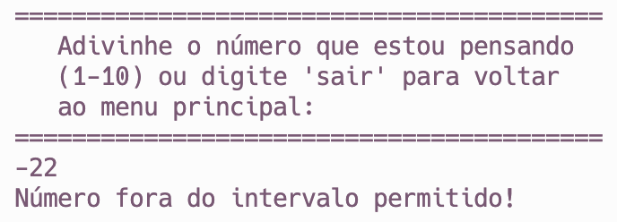
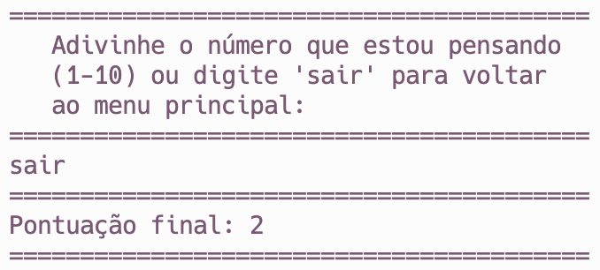

# Advinhe o Número

Meu nome é Tamires Silva, e este é um jogo simples de "Adivinhe o Número" que desenvolvi em Java. O jogo foi criado como parte de um exercício da faculdade e evoluído com funcionalidades adicionais para torná-lo mais interessante.

## Screenshots

Aqui estão algumas capturas de tela do jogo:

- **Menu Principal**:
  

- **Escolha da Dificuldade**:
  

- **Rodada com Acerto**:
  

- **Rodada com Erro**:
  

- **Teste de Número Fora do Intervalo Permitido**:
  

- **Pontuação Final**:
  

## Como Jogar

1. Execute o programa em um ambiente Java.
2. Escolha uma opção no menu principal.
    - **1. Começar o Jogo**: Inicie o jogo e escolha o modo de jogo.
    - **2. Sair**: Encerre o jogo.
3. Escolha o modo de jogo:
    - **Modo Fácil (1-10)**: Adivinhe o número secreto entre 1 e 10.
    - **Modo Médio (1-50)**: Adivinhe o número secreto entre 1 e 50.
    - **Modo Difícil (1-100)**: Adivinhe o número secreto entre 1 e 100.
4. Adivinhe o número secreto. Digite um número ou "sair" a qualquer momento para encerrar o jogo.
5. Receba feedback sobre a sua tentativa e acumule pontos.
6. Continue a jogar ou retorne ao menu principal.

## Habilidades Treinadas em Java

Ao desenvolver este jogo, aprimorei minhas habilidades em Java, incluindo:

- Manipulação de entrada do usuário.
- Uso de estruturas de controle, como loops e condicionais.
- Geração de números aleatórios.
- Organização de código em classes e métodos.
- Manipulação de exceções para lidar com erros de entrada.
- Utilização de arrays e estruturas de dados simples.

Sinta-se à vontade para explorar o código-fonte para entender melhor o funcionamento do jogo e aprimorar suas habilidades em Java.

## Créditos

Este jogo foi desenvolvido por Tamires Silva (GitHub: [tamiresborota](https://github.com/tamiresborota)). A ideia do jogo surgiu de um exercício da faculdade e foi evoluída com funcionalidades adicionais para torná-lo mais interessante.

